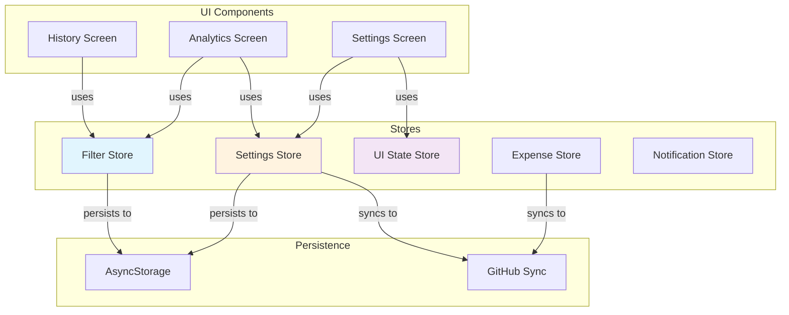
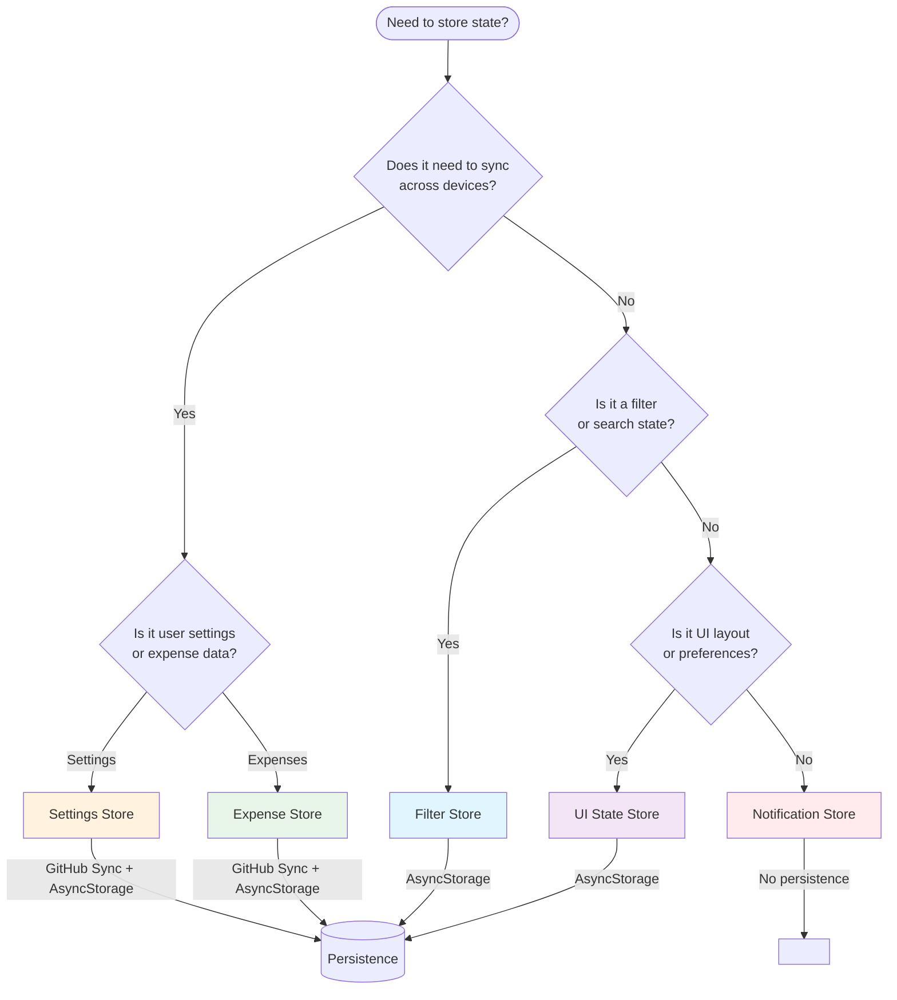
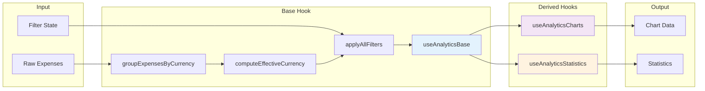
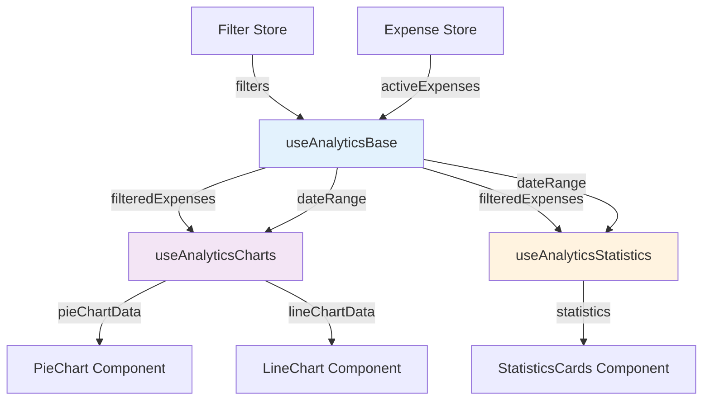

# Architecture Documentation

## Overview

This document describes the architecture patterns and design decisions used in the Expense Buddy application.

## Store Architecture

### XState Store Pattern

The application uses XState's lightweight store (`@xstate/store`) for state management. This provides:

- **Predictable state updates** through explicit events
- **Type safety** with TypeScript
- **DevTools support** for debugging
- **Minimal boilerplate** compared to full XState machines

### Store Relationships



### Store Selection Flowchart



### Store Types

#### 1. Filter Store (`stores/filter-store.ts`)

**Purpose**: Manages analytics and history filter state with cross-tab synchronization.

**When to use**:

- Analytics filters (time window, categories, payment methods)
- History filters (search, amount range)
- Any filter state that should persist across tabs

**Key features**:

- Debounced search input (300ms)
- Persistence to AsyncStorage
- Individual selectors for each property to prevent unnecessary re-renders
- Batch updates via `applyFilters` event

```typescript
const { filters, setTimeWindow, setSearchQuery } = useFilters()
```

#### 2. UI State Store (`stores/ui-state-store.ts`)

**Purpose**: Manages device-local UI preferences that should NOT sync across devices.

**When to use**:

- Section expansion states (payment methods, instruments)
- UI layout preferences
- Any device-specific UI state

**Key features**:

- AsyncStorage persistence
- No sync with GitHub
- Independent per device

```typescript
// Store is accessed directly
uiStateStore.trigger.setPaymentMethodExpanded({ expanded: true })
```

#### 3. Settings Store (`stores/settings-store.ts`)

**Purpose**: Manages application settings with GitHub sync support.

**When to use**:

- User preferences (theme, language, currency)
- Categories and payment instruments
- Sync configuration

**Key features**:

- Sync state tracking (synced/modified/conflict)
- Hash-based change detection
- Automatic persistence
- GitHub synchronization

```typescript
const { settings, setTheme } = useSettings()
```

### Store Selection Guide

| Use Case       | Store              | Persistence | Sync |
| -------------- | ------------------ | ----------- | ---- |
| Filter state   | Filter Store       | Yes         | No   |
| UI preferences | UI State Store     | Yes         | No   |
| User settings  | Settings Store     | Yes         | Yes  |
| Expense data   | Expense Store      | Yes         | Yes  |
| Notifications  | Notification Store | No          | No   |

## Analytics Hook Architecture

### Hook Decomposition Strategy

The analytics functionality is split into focused hooks for better performance and tree-shaking:

### Analytics Data Flow



### Hook Dependencies



#### 1. useAnalyticsBase (`hooks/use-analytics-base.ts`)

**Responsibilities**:

- Currency grouping and selection
- Filter application (single-pass)
- Date range calculation

**Returns**:

- `filteredExpenses`: Expenses after all filters
- `availableCurrencies`: List of currencies in data
- `effectiveCurrency`: Selected or auto-detected currency
- `dateRange`: Start and end dates for charts
- Individual filter callbacks for granular control

#### 2. useAnalyticsCharts (`hooks/use-analytics-charts.ts`)

**Responsibilities**:

- Pie chart data preparation
- Line chart data preparation
- Payment method/instrument chart data

**Performance**: Only recomputes when filtered expenses change

#### 3. useAnalyticsStatistics (`hooks/use-analytics-statistics.ts`)

**Responsibilities**:

- Total/average calculations
- Trend analysis
- Statistics card data

#### 4. useAnalyticsData (Composite)

**Status**: Deprecated

**Reason**: The composite hook combines all three hooks but causes unnecessary re-renders. Use individual hooks instead.

### Single-Pass Filter Optimization

**Problem**: Sequential filtering creates intermediate arrays:

```typescript
// Bad: O(n×4) with 4 intermediate arrays
const timeFiltered = filterByTimeWindow(expenses)
const categoryFiltered = filterByCategories(timeFiltered)
const methodFiltered = filterByPaymentMethods(categoryFiltered)
const result = filterByPaymentInstruments(methodFiltered)
```

**Solution**: Single-pass filtering in `utils/analytics/filters.ts`:

```typescript
// Good: O(n) single pass
const result = applyAllFilters(expenses, filterState, instruments)
```

**Benefits**:

- 4× fewer array allocations
- Better memory usage
- Consistent filtering logic across app

**Filter Algorithm Flow**:

```mermaid
flowchart TD
    Start([Start]) --> CheckActive{Any filters<br/>active?}
    CheckActive -->|No| ReturnAll[Return all expenses]
    CheckActive -->|Yes| BuildSets[Build lookup Sets<br/>for categories, methods,<br/>instruments]

    BuildSets --> BuildMap[Build instrument<br/>Map for O(1) lookup]
    BuildMap --> Loop[For each expense]

    Loop --> CheckTime{Time window<br/>matches?}
    CheckTime -->|No| Next[Next expense]
    CheckTime -->|Yes| CheckAmount{Amount in<br/>range?}

    CheckAmount -->|No| Next
    CheckAmount -->|Yes| CheckCat{Category in<br/>selection?}

    CheckCat -->|No| Next
    CheckCat -->|Yes| CheckMethod{Payment method<br/>matches?}

    CheckMethod -->|No| Next
    CheckMethod -->|Yes| CheckInst{Instrument<br/>matches?}

    CheckInst -->|No| Next
    CheckInst -->|Yes| CheckSearch{Search query<br/>matches?}

    CheckSearch -->|No| Next
    CheckSearch -->|Yes| AddResult[Add to results]

    Next --> More{More<br/>expenses?}
    More -->|Yes| Loop
    More -->|No| ReturnResult[Return filtered<br/>results]

    ReturnAll --> End([End])
    ReturnResult --> End

    style BuildSets fill:#e3f2fd
    style BuildMap fill:#e3f2fd
    style CheckSearch fill:#fff3e0
```

**Implementation details**:

- Uses Set lookups for O(1) category/method checks
- Cached instrument Map for O(1) lookups
- Search performed last (most expensive check)
- Early return if no filters active

## Type Organization

### Analytics Types (`types/analytics.ts`)

All analytics-related types are exported through a single barrel file:

```typescript
// Import from single source of truth
import type { TimeWindow, FilterState, PieChartDataItem } from "../types/analytics"

// Instead of scattered imports:
// import type { TimeWindow } from "../utils/analytics/time"
// import type { FilterState } from "../utils/analytics/filters"
```

**Types exported**:

- `TimeWindow` - Time period options
- `FilterState` - Complete filter state
- `PaymentInstrumentSelectionKey` - Instrument identifier
- `PaymentMethodSelectionKey` - Method identifier
- `PieChartDataItem` - Pie chart data structure
- `PaymentMethodChartDataItem` - Payment method chart data
- `PaymentInstrumentChartDataItem` - Instrument chart data
- `LineChartDataItem` - Line chart data structure
- `CategoryColorMap` - Dynamic category colors
- `DateRange` - Date range for calculations

## Performance Optimizations

### 1. Debounced Search

Search queries are debounced at the store level (300ms) to prevent excessive re-renders while typing.

### 2. Individual Selectors

Filter store uses individual selectors for each property:

```typescript
const timeWindow = useSelector(filterStore, (s) => s.context.timeWindow)
const searchQuery = useSelector(filterStore, (s) => s.context.searchQuery)
```

This prevents re-renders when unrelated filter properties change.

### 3. Memoized Filter State

The filters object is memoized to maintain stable references:

```typescript
const filters = useMemo(
  () => ({
    timeWindow,
    selectedCategories, // ...
  }),
  [timeWindow, selectedCategories /* ... */]
)
```

### 4. FlashList Virtualization

History screen uses FlashList with:

- `getItemType` for different recycling pools
- `overrideItemLayout` for precise sizing
- `keyExtractor` for stable keys

## Testing Strategy

### Property-Based Tests

Critical pure functions use property-based testing with `fast-check`:

- **Filter functions**: `utils/analytics/filters.property.test.ts`
- **Currency utilities**: `utils/currency.property.test.ts`
- **Analytics calculations**: `utils/analytics/analytics-calculations.property.test.ts`

**Benefits**:

- Tests edge cases automatically
- Verifies invariants across wide input ranges
- Catches bugs that unit tests miss

### Store Tests

XState stores are tested with:

- State transition verification
- Event handling
- Persistence roundtrips
- Property-based state consistency

## Best Practices

### 1. Store Events

- Use descriptive event names: `setTimeWindow`, `applyFilters`
- Batch related updates: `applyFilters` instead of multiple individual events
- Keep events pure - side effects in `enqueue.effect`

### 2. Hook Design

- Split large hooks into focused ones
- Return memoized objects
- Use individual selectors for XState stores
- Document return types explicitly

### 3. Type Safety

- Export types through barrel files
- Use `type` imports when possible
- Avoid `any` - use `unknown` with type guards

### 4. Performance

- Use single-pass algorithms where possible
- Debounce user input
- Memoize expensive calculations
- Virtualize long lists

## Migration Guide

### From useAnalyticsData to Individual Hooks

**Before**:

```typescript
const data = useAnalyticsData(timeWindow, categories, methods, instruments)
// Re-renders when ANY data changes
```

**After**:

```typescript
const base = useAnalyticsBase(timeWindow, categories, methods, instruments, currency)
const charts = useAnalyticsCharts(base.filteredExpenses, base.dateRange, instruments, t)
const stats = useAnalyticsStatistics(base.filteredExpenses, timeWindow, base.dateRange)
// Only re-renders when specific data changes
```

### From Scattered Type Imports to Barrel

**Before**:

```typescript
import type { TimeWindow } from "../utils/analytics/time"
import type { FilterState } from "../utils/analytics/filters"
```

**After**:

```typescript
import type { TimeWindow, FilterState } from "../types/analytics"
```
