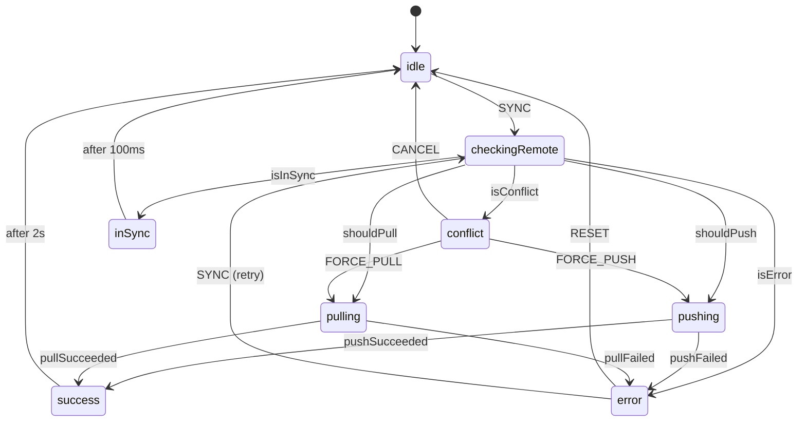
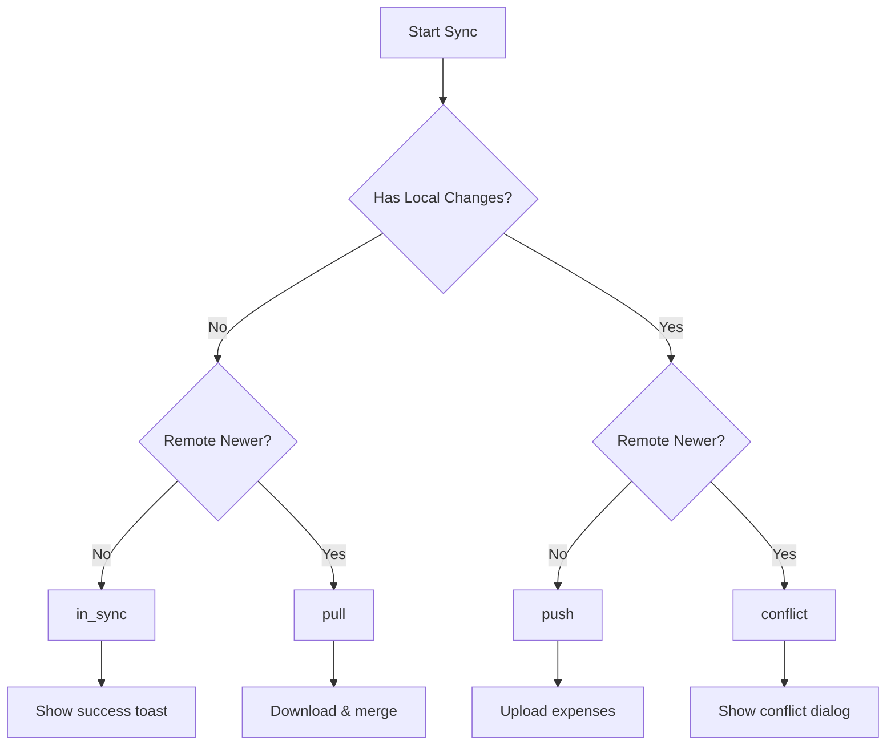
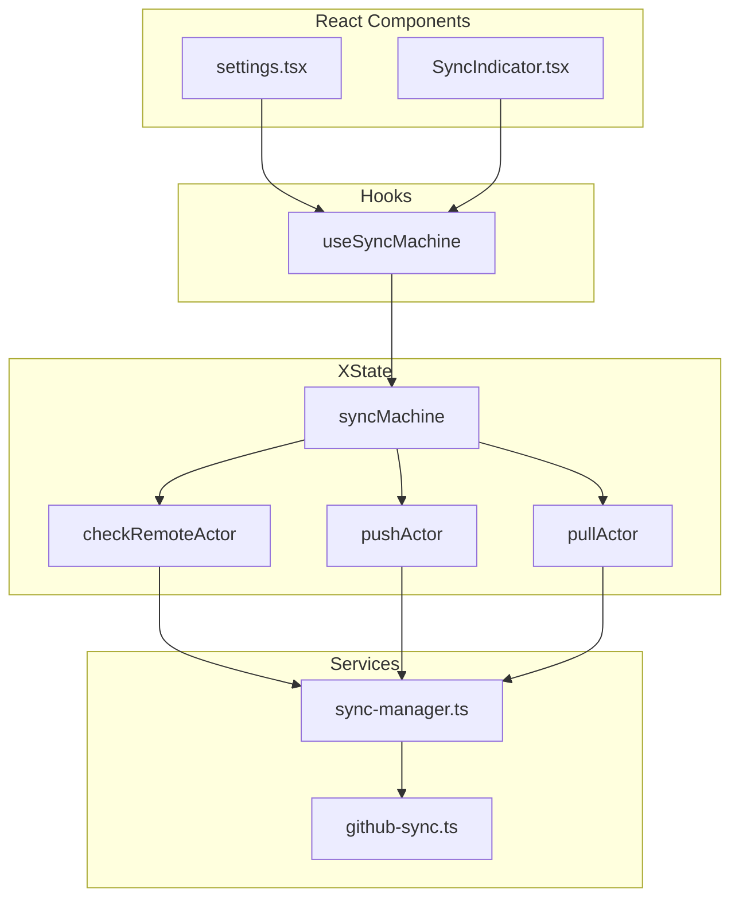

# ADR-001: XState Sync State Machine

**Date:** 2026-01-06  
**Status:** Accepted  
**Author:** Implementation via Gemini

---

## Context

The expense tracker app uses GitHub as a sync backend. The original sync logic used TanStack Query (React Query) hooks with imperative `useMutation` calls organized as:

- `useSyncPush` - Upload expenses to GitHub
- `useSyncPull` - Download expenses from GitHub
- `useSmartSync` - Orchestrate push/pull based on timestamps

### Problems with the Original Approach

1. **False conflict detection**: Creating a new expense triggered "conflict" alerts even when remote was unchanged
2. **Unnecessary downloads**: App downloaded remote data even when already in sync
3. **Scattered logic**: Sync orchestration spread across multiple hooks and components
4. **useEffect side effects**: Required `useEffect` in components to react to mutation states
5. **Testing complexity**: Difficult to test state transitions in isolation

---

## Decision

Replace the imperative TanStack Query approach with a **declarative XState v5 state machine**.

### State Machine Design



### Sync Direction Logic



---

## Implementation

### Files Created

| File                        | Purpose                                                |
| --------------------------- | ------------------------------------------------------ |
| `services/sync-machine.ts`  | XState machine definition with actors, guards, actions |
| `hooks/use-sync-machine.ts` | React hook wrapping the machine                        |

### Key Patterns

#### 1. Callbacks Instead of useEffect

The machine accepts callbacks in the `SYNC` event, invoked via entry actions:

```typescript
syncMachine.sync({
  localExpenses,
  callbacks: {
    onConflict: () => Alert.alert(...),
    onSuccess: (result) => addNotification(...),
    onInSync: () => addNotification("Already in sync"),
    onError: (error) => addNotification(error, "error"),
  },
})
```

This eliminates the need for `useEffect` to react to state changes.

#### 2. Auto-Transitions

Terminal states auto-reset to `idle`:

```typescript
success: {
  entry: "invokeOnSuccess",
  after: {
    SUCCESS_DISPLAY_TIME: "idle",  // 2 seconds
  },
}
```

#### 3. Actors for Async Operations

XState actors wrap existing sync functions:

```typescript
const checkRemoteActor = fromPromise(async ({ input }) => {
  return determineSyncDirection(input.hasLocalChanges)
})

const pushActor = fromPromise(async ({ input }) => {
  return syncUp(input.expenses, input.settings, input.syncSettingsEnabled)
})
```

### Architecture Diagram



---

## Removed Dependencies

| Dependency              | Reason             |
| ----------------------- | ------------------ |
| `@tanstack/react-query` | Replaced by XState |
| `QueryClientProvider`   | No longer needed   |

### Removed Code

| Code                | Lines | Reason                       |
| ------------------- | ----- | ---------------------------- |
| `hooks/use-sync.ts` | ~200  | React Query hooks replaced   |
| `autoSync`          | ~100  | Orchestration now in machine |
| `analyzeConflicts`  | ~90   | Never used in production     |

---

## Consequences

### Positive

1. **Single source of truth** for sync state
2. **Declarative** - states and transitions are explicit
3. **Testable** - machine can be tested without React
4. **No useEffect** - callbacks handle side effects
5. **Smaller bundle** - removed React Query (~15KB gzipped)
6. **Visualizable** - can use XState Visualizer for debugging

### Negative

1. **Learning curve** for XState if unfamiliar
2. **Verbose** - machine definition is longer than hooks
3. **Two packages** - requires `xstate` + `@xstate/react`

### Neutral

- Existing `sync-manager.ts` functions (`syncUp`, `syncDown`, `determineSyncDirection`) unchanged
- Timestamp management encapsulated in `syncUp`

---

## Alternatives Considered

### 1. Keep React Query + Add Zustand for State

**Rejected**: Would still have scattered state, React Query overkill for single-source sync.

### 2. Custom useReducer Hook

**Rejected**: Would end up reimplementing XState features (async handling, guards, etc.).

### 3. Jotai/Zustand State Machine

**Rejected**: Less tooling support, no built-in visualization, manual async handling.

---

## References

- [XState v5 Documentation](https://stately.ai/docs/xstate)
- [XState with React](https://stately.ai/docs/xstate-react)
- [State Machine Patterns](https://stately.ai/docs/state-machine-patterns)
