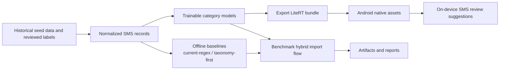
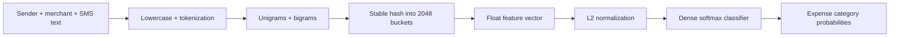

# SMS ML Model Architectures

This document captures the main category-model architectures used in the SMS ML
workspace and the app integration path they support.

The diagrams intentionally focus on the category-prediction contract only.
Transaction detection, amount parsing, dates, and payment-method hints remain
deterministic in the app parser.

## Workspace Pipeline Overview

## Seed LiteRT v1

`seed-litert-v1` is the first Android-native model contract. It uses hashed token
and bigram counts with L2 normalization, then a single softmax head.

## Current Android Model

`seed-litert-embed-augmented-v1` is the current stronger Android-shippable model.
It keeps the deterministic hashed-text contract, but moves from bag-of-words counts
to a hashed token-ID sequence consumed by an embedding model.

```mermaid
flowchart LR
    A[Sender + merchant + SMS text] --> B[Lowercase + tokenization]
    B --> C[Unigrams + bigrams]
    C --> D[Stable hash into 8192 buckets]
    D --> E[Int token-id sequence\nlength 96 max]
    E --> F[Embedding table\n48 dims]
    F --> G[Global average pooling]
    G --> H[Dense ReLU hidden layer\n64 units]
    H --> I[Dropout]
    I --> J[Dense softmax classifier]
    J --> K[Expense category probabilities]
```

## Attention Candidate

`seed-litert-attention-v1` uses the same hashed token-ID sequence input as the
embedding model, but adds recurrent sequence modeling and attention pooling. It is
currently an offline architecture experiment because its exported bundle still needs
Select TF ops.

```mermaid
flowchart LR
    A[Sender + merchant + SMS text] --> B[Lowercase + tokenization]
    B --> C[Unigrams + bigrams]
    C --> D[Stable hash into token IDs]
    D --> E[Int sequence\nlength 96 max]
    E --> F[Embedding layer\n48 dims]
    F --> G[LSTM encoder\n48 units]
    G --> H[Attention hidden layer\n32 units]
    H --> I[Attention scores + softmax weights]
    I --> J[Attention context vector]
    J --> K[Dense ReLU hidden layer\n48 units]
    K --> L[Dropout]
    L --> M[Dense softmax classifier]
    M --> N[Expense category probabilities]
```

## Integration Notes

- `seed-litert-v1` and `seed-litert-embed-augmented-v1` are usable with the current Android runtime.
- `seed-litert-embed-augmented-v1` is the current best Android-ready model because it improves representation quality without changing the fully on-device review-first flow.
- `seed-litert-attention-v1` remains offline-only until the Android runtime is expanded to support the exported ops it needs.
- confidence gating and fallback-to-regex behavior are app-policy decisions layered on top of these model outputs.